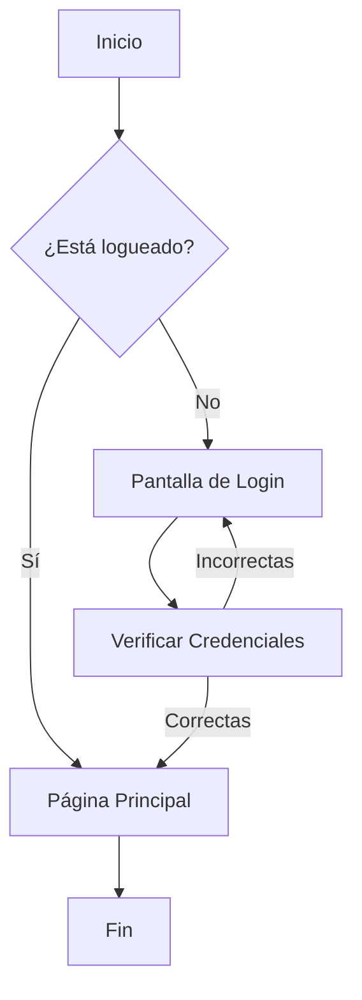

Guía                    ​​​
rápida
de
Markdown
Sintaxis clásica y de GitHub


mouredev.pro/recursos
                                          2


Índice
Introducción​                             3
Sintaxis básica​                         4
    Encabezados​                         5
    Párrafos y saltos de línea​          5
    Reglas horizontales​                 6
    Énfasis: Negrita y Cursiva​          6
    Listas​                               7
    Enlaces (Hipervínculos)​             8
    Imágenes​                            9
    Citas (Blockquotes)​                 9
    Código y fragmentos de código​       10
    Escapado de caracteres especiales​   10
    HTML en Markdown​                    11
    Emojis​                              11
Sintaxis extendida de GitHub​            12
    Tablas​                              13
    Tachado​                             14
    Listas de tareas​                    14
    Referencias y menciones​             15
    Notas a pie de página​               15
    Alertas​                             16
Contenido avanzado​                      17
    LaTeX​                               17
    Mermaid​                             17
Hoja de trucos Markdown + GFM​           19
Herramientas recomendadas​               20
                                                                              3


Introducción
Markdown es un lenguaje de marcado ligero que permite dar formato a
texto plano (legible en cualquier dispositivo) de forma sencilla y legible,
convirtiéndose fácilmente en HTML.


Su sintaxis es muy sencilla, intuitiva y potente, ya que está formada por
caracteres simples fáciles de recordar (por ejemplo, #, *, [], etc).


Es muy usado en GitHub, documentación técnica, blogs, foros, notas
personales y últimamente para interactuar con sistemas de IA.


Los documentos Markdown son simplemente archivos de texto plano
con extensión .md.


Puedes escribir Markdown desde cualquier editor de texto, aunque
también existen herramientas especializadas y soporte dentro de
cualquier editor de código (que cuentan con vistas previas para
visualizar el resultado del texto formateado en Markdown).


Esta es una guía que te enseñará a escribir los elementos más comunes
de Markdown clásico y extendido por GitHub.


Para acceder a la especificación completa consulta commonmark.org y
docs.github.com/get-started/writing-on-github.
                                                                                     4


Sintaxis básica
La sintaxis básica de Markdown (a menudo llamada Markdown clásico u
original) cubre los elementos más comunes de formato de texto: encabezados,
párrafos, énfasis (negrita/cursiva), listas, enlaces, imágenes, citas y bloques de
código, entre otros.


En la actualidad, la sintaxis original ha evolucionado hacia el estándar
CommonMark, una iniciativa para crear una especificación de Markdown
completa. No busca añadir muchas características nuevas, sino formalizar su
uso. Podemos decir que, hoy en día, CommonMark es el estándar real cuando
nos referimos a Markdown básico.
                                                                                    5


Encabezados
Se admiten seis niveles de encabezado. La almohadilla (#) establece el nivel
jerárquico.


   None
   # Título de nivel 1
   ## Título de nivel 2
   ### Título de nivel 3
   #### Título de nivel 4
   ##### Título de nivel 5
   ###### Título de nivel 6


Título de nivel 1

Título de nivel 2

Título de nivel 3

Título de nivel 4

Título de nivel 5

Título de nivel 6


Párrafos y saltos de línea
Para separar párrafos, se debe dejar una línea completamente en blanco entre
ellos. Si no se deja esta línea en blanco, Markdown considerará que las líneas de
texto pertenecen al mismo párrafo y las unirá.


Para forzar un salto de línea dentro de un mismo párrafo puedes terminar con
dos espacios en blanco y pulsar enter.
                                                                6


Reglas horizontales
Las reglas son divisiones visuales en forma de línea.


   None
   ---
   ***
   ___
   - - -
   * * *
   _ _ _


Todas estas combinaciones acabarán produciendo esta división:


Énfasis: Negrita y Cursiva

   None
   **texto en negrita**
   *texto en cursiva*


texto en negrita
texto en cursiva
                                                                            7


Listas
Podemos crear listas no ordenadas (viñetas) como ordenadas (numeradas).


Las listas no ordenadas comienzan cada elemento con -, * o +, seguido de
espacio. Para anidar sub-listas indentamos los elementos con tabulación o
cuatro espacios.


   None
   - Elemento 1
   - Elemento 2
   - Elemento 3
   ​      - Sub-elemento 3.1
   ​      - Sub-elemento 3.2
   ​      ​       - Sub-sub-elemento 3.2.1
   - Elemento 4
   * Elemento 5
   + Elemento 6


   ●​ Elemento 1
   ●​ Elemento 2
   ●​ Elemento 3
          ○​ Sub-elemento 3.1
          ○​ Sub-elemento 3.2
                  ■​ Sub-sub-elemento 3.2.1
   ●​ Elemento 4
   ●​ Elemento 5
   ●​ Elemento 6
                                                                        8


Las listas ordenadas comienzan por un número seguido de un punto y un
espacio. También admiten sub-listas.


   None
   1. Elemento 1
   2. Elemento 2
   ​      1. Elemento 2.1
   ​      2. Elemento 2.2
   ​      ​     1. Elemento 2.2.1
   3. Elemento 3


   1.​ Elemento 1
   2.​ Elemento 2
          1.​ Elemento 2.1
          2.​ Elemento 2.2
                1.​ Elemento 2.2.1
   3.​ Elemento 3


Enlaces (Hipervínculos)
Markdown soporta varias formas de crear enlaces.


   None
   [Ir a Google](https://google.com)
   <https://google.com>


Ir a Google
https://google.com
                                                                                  9


Imágenes
La sintaxis de las imágenes es similar a la de los enlaces, con la diferencia de que
comienza con un signo de exclamación !.
La URL puede ser absoluta o relativa al documento.


   None
   


Citas (Blockquotes)
Son textos citados o destacados que pueden llegar a anidarse.


   None
   > Cita de primer nivel
   >> Cita de segundo nivel dentro de la anterior
   >>> Cita de tercer nivel


     Cita de primer nivel


           Cita de segundo nivel dentro de la anterior


                Cita de tercer nivel
                                                                                           10


Código y fragmentos de código
Markdown permite incluir código fuente como una línea dentro de un párrafo o
como bloques multilínea.


   None
   `git status`


   ```
   <html>
   ​        <head>
   ​        ​        <title>Ejemplo</title>
   ​        </head>
   ​        <body>
   ​        ​        <h1>Hola Mundo</h1>
   ​        </body>
   </html>
   ```


git status


   None
   <html>
   ​        <head>
   ​        ​        <title>Ejemplo</title>
   ​        </head>
   ​        <body>
   ​        ​        <h1>Hola Mundo</h1>
   ​        </body>
   </html>


El fragmento de código parece redundante, ya que las representaciones de las sintaxis de
Markdown están utilizando este mismo componente.


Escapado de caracteres especiales
¿Qué pasa si necesitas escribir literalmente caracteres que Markdown usa para
formato (por ejemplo un * o un #), sin que se interpreten?
                                                                                    11


Para ello existe el escape de caracteres con la barra invertida \. Anteponiendo \
a un carácter especial, le indicas a Markdown que no lo procese como formato.


   None
   \# No se interpretará como un título de nivel 1


# No se interpretará como un título de nivel 1


HTML en Markdown
Una de las características potentes (y a veces necesarias) de Markdown es que
permite incluir HTML directamente dentro del texto. Si Markdown por sí solo no
ofrece algo que necesitas (por ejemplo, un video embebido, una tabla muy
compleja o un estilo particular, entre otros), puedes escribir el HTML
correspondiente y la mayoría de procesadores Markdown lo insertarán tal cual
en el resultado.


Ten en cuenta de que no todos los entornos pueden admitir cualquier tipo de HTML.


   None
   <p style="text-align: center; color: red;">Este texto estará centrado
   y en rojo.</p>


                        Este texto estará centrado y en rojo.


Emojis
Por supuesto, Markdown también soporta emojis       😁.
   None
   💪🤘💻🤣
                                                                                    12


Sintaxis extendida de GitHub
Si bien la sintaxis básica de Markdown es muy potente, GitHub impulsó una
versión extendida llamada GitHub Flavored Markdown (GFM) que agrega varias
características útiles para los desarrolladores. De hecho, GFM se basa en el
estándar CommonMark y añade soporte para tablas, tachado, enlaces
automáticos, listas de tareas, entre otras mejoras . A continuación, te describo
las extensiones principales que GFM ofrece sobre el Markdown clásico.
                                                                                 13


Tablas
Puedes crear tablas utilizando sólo texto combinando barras verticales | para las
columnas y guiones - para el encabezado. También puedes controlar la
alineación del texto en las columnas añadiendo dos puntos : en la línea de
guiones.


   None
   | Encabezado 1 | Encabezado 2 | Encabezado 3 |
   | ------------ | ------------ | ------------ |
   | Dato A1       | Dato A2           | Dato A3       |
   | Dato B1       | Dato B2           | Dato B3       |


   | Izquierda     | Centrado      | Derecha |
   | :---          | :---:         | ---:          |
   | Dato 1        | Dato 2        | Dato 3        |
   | Texto         | Más texto     | Final         |


Encabezado 1                 Encabezado 2                  Encabezado 3

Dato A1                      Dato A2                       Dato A3

Dato B1                      Dato B2                       Dato B3


Izquierda                              Centrado                           Derecha

Dato 1                                  Dato 2                             Dato 3

Texto                                  Más texto                             Final
                                                                                  14


Tachado
Para tachar texto, utiliza las dobles virgulillas ~~.


   None
   ~~este texto está tachado~~


este texto está tachado


Listas de tareas
Una característica muy útil (especialmente en contextos de gestión de proyectos
en GitHub) son las listas de tareas. La sintaxis es una extensión de las listas
normales: se escribe una lista (ordenada o sin ordenar) y en lugar de solo el
guión o número, se añade [ ] o [x] al comienzo del texto del elemento para
indicar una casilla de verificación sin marcar o marcada .


   None
   - [x] Tarea 1
   - [ ] Tarea 2
   - [ ] Tarea 3


      ​ Tarea 1
      ​ Tarea 2
      ​ Tarea 3
                                                                                     15


Referencias y menciones
Dentro de los entornos de GitHub (issues, commits, pull requests, comentarios),
GFM añade atajos para referenciar personas y artefactos del repositorio de forma
automática.
    ●​ @Menciones de usuarios
    ●​ #Número de una issue, pull request o SHA de un commit de ese repositorio
       o de otro si anteponemos el nombre de usuario del propietario.
    ●​ Autolink de URLs sin necesidad de utilizar la sintaxis de Markdown


    None
    @mouredev
    #123
    https://moure.dev
    propietario/repositorio#123


Notas a pie de página
Las notas a pie de página permiten añadir información aclaratoria o citas sin
interrumpir el flujo principal del texto.


    None
    Markdown es un lenguaje de marcado ligero.[^1] Fue creado en 2004 por
    John Gruber.


    [^1]: Su objetivo principal es permitir crear texto rico mediante
    texto plano fácilmente convertible a HTML.


Markdown es un lenguaje de marcado ligero.1 Fue creado en 2004 por John
Gruber.


1
Su objetivo principal es permitir crear texto rico mediante texto plano fácilmente
convertible a HTML.
                                                                                    16


Alertas
Las alertas se utilizan para destacar información crítica. En GitHub, se muestran
con colores e iconos distintivos para indicar la importancia del contenido.


   None
   > [!NOTE]
   > Texto


   > [!TIP]
   > Texto


   > [!IMPORTANT]
   > Texto


   > [!WARNING]
   > Texto


   > [!CAUTION]
   > Texto
                                                                                  17


Contenido avanzado

LaTeX
Más allá del texto y las imágenes, muchas plataformas que usan Markdown
permiten la creación de contenido rico y especializado, como fórmulas
matemáticas y diagramas.


Para la escritura científica y académica, la capacidad de renderizar ecuaciones
matemáticas complejas es esencial. Muchos procesadores de Markdown
soportan la sintaxis de LaTeX para este propósito.


   None
   $$3^{4^5} + \frac{1}{2}$$


   $$int_{0}^{\infty} e^{-x^2} \, dx = \frac{\sqrt{\pi}}{2}$$


Mermaid
GitHub y otras plataformas han integrado la librería Mermaid.js, que permite
crear diagramas y flujos de trabajo directamente en Markdown. Esto se logra
escribiendo la sintaxis de Mermaid dentro de un bloque de código cercado con el
identificador de lenguaje.
                                          18


None

                                                                        19


Hoja de trucos Markdown + GFM
Clásico (CommonMark)

Encabezados                   # Título de nivel 1
                              ###### Título de nivel 6

Reglas horizontales           --- / *** / ___ / - - - / * * * / _ _ _

Negrita y cursiva             **texto en negrita**
                              *texto en cursiva*

Listas                        - Elemento 1
Soporta -, * o +                  - Sub-elemento 1.1
                                      - Sub-sub-elemento 1.1.1

Enlaces                       [Texto](url)

Imágenes                      

Citas                         > Cita de primer nivel
                              >>> Cita de tercer nivel

Código                        `código en una línea`
                              ```
                              código en párrafo
                              ```

HTML                          Soporta HTML incrustado directamente


GitHub (GFM)

Tablas                        | Encabezado 1 | Encabezado 2 |
:--- (alineación izquierda)   | ------------ | ------------ |
:---: (alineación central)    | Dato A1      | Dato A2      |
                              | Dato B1      | Dato B2      |
---: (alineación derecha)

Tachado                       ~~este texto está tachado~~

Listas de tareas              - [x] Tarea completada
                              - [ ] Tarea pendiente

Referencias y menciones       @usuario #id_issue_pr_sha

Notas a pie                   Definición: [ˆ1] y referencia: [ˆ1]:

Alertas                       > [!NOTE/TIP/IMPORTANT/WARNING/CAUTION]


Contenido avanzado            Sintaxis de LaTeX o Mermaid
                                                                           20


Herramientas recomendadas
   ●​ Visual Studio Code: https://code.visualstudio.com
   ●​ Ghostwriter: https://ghostwriter.kde.org
   ●​ Obsidian: https://obsidian.md
   ●​ iA Writer: https://ia.net/writer


¿Quieres aprender más sobre
programación y desarrollo?

Aquí tienes mis cursos para aprender desde cero.


Cursos gratis en YouTube:
https://moure.dev


Curso con extras (lecciones por tema, ejercicios, soporte personalizado,
comunidad, test y certificado) en el campus de estudiantes mouredev pro:
https://mouredev.pro


(Utiliza el cupón “PRO” para acceder con un 10% de descuento a todas las
suscripciones y cursos del campus).
Estudia programación y desarrollo de software de manera diferente
